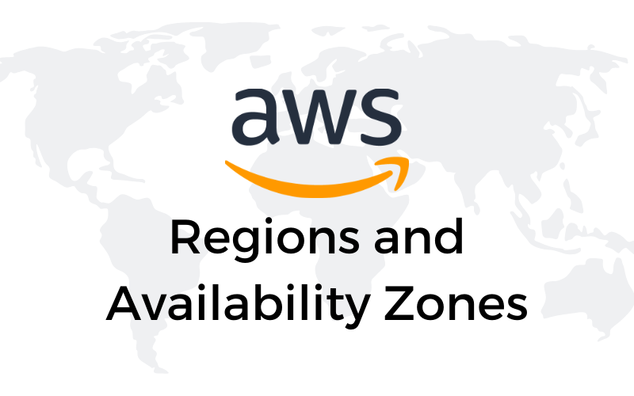

# AWS Regions and Availability Zones

## Cloud Research

### Regions
- It is a geographical area that consists of 2 or more AZ
- Regions are spread all around the world
- Regions are identified by a code followed by a letter identifier; for example, `np-northeast-1` (Tokyo region)

### Availability Zone (AZ)
- One or more data centers that are close enough to each other can be considered as 1 Availability Zone
- Availability Zones are important because they can ensure business and operational continuity in case of disasters to one of the data centers included in the AZ. Each data center inside a AZ has its own building, power supply, networking and connectivity.
- All AZs are interconnected with high-bandwidth and low latency network. The traffic between AZ is encrypted.
- AZ are within 100km from each other
- AZ are identified by the Region code followed by a letter. Here below an example of all the AZs in the Tokyo (`ap-northeast-1`) region:
```
> aws ec2 describe-availability-zones --region ap-northeast-1

{
    "AvailabilityZones": [
        {
            "State": "available",
            "OptInStatus": "opt-in-not-required",
            "Messages": [],
            "RegionName": "ap-northeast-1",
            "ZoneName": "ap-northeast-1a",
            "ZoneId": "apne1-az4",
            "GroupName": "ap-northeast-1",
            "NetworkBorderGroup": "ap-northeast-1",
            "ZoneType": "availability-zone"
        },
        {
            "State": "available",
            "OptInStatus": "opt-in-not-required",
            "Messages": [],
            "RegionName": "ap-northeast-1",
            "ZoneName": "ap-northeast-1c",
            "ZoneId": "apne1-az1",
            "GroupName": "ap-northeast-1",
            "NetworkBorderGroup": "ap-northeast-1",
            "ZoneType": "availability-zone"
        },
        {
            "State": "available",
            "OptInStatus": "opt-in-not-required",
            "Messages": [],
            "RegionName": "ap-northeast-1",
            "ZoneName": "ap-northeast-1d",
            "ZoneId": "apne1-az2",
            "GroupName": "ap-northeast-1",
            "NetworkBorderGroup": "ap-northeast-1",
            "ZoneType": "availability-zone"
        }
    ]
}
```

### Edge locations
- They are endpoints which are used for caching content
- There exist more edge locations than regions
- They consists of CloudFront, Amazon's Content Delivery Network (CDN)

## Resources
- [AWS docs - Regions and Zones](https://docs.aws.amazon.com/AWSEC2/latest/UserGuide/using-regions-availability-zones.html)

## Social Proof

✍️ Show that you shared your process on Twitter or LinkedIn

[Twitter](https://twitter.com/alebaffa/status/1331592965316198402)
